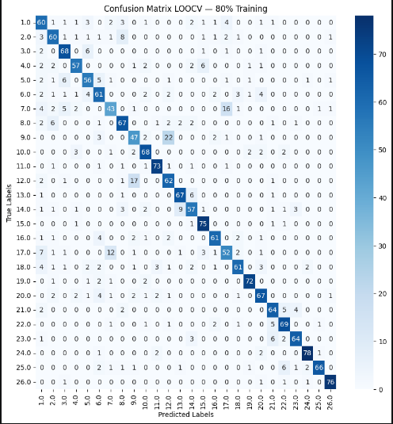
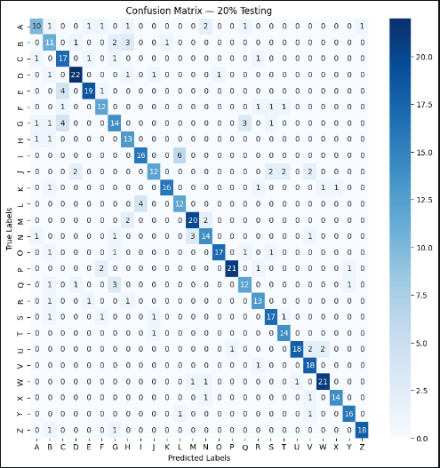
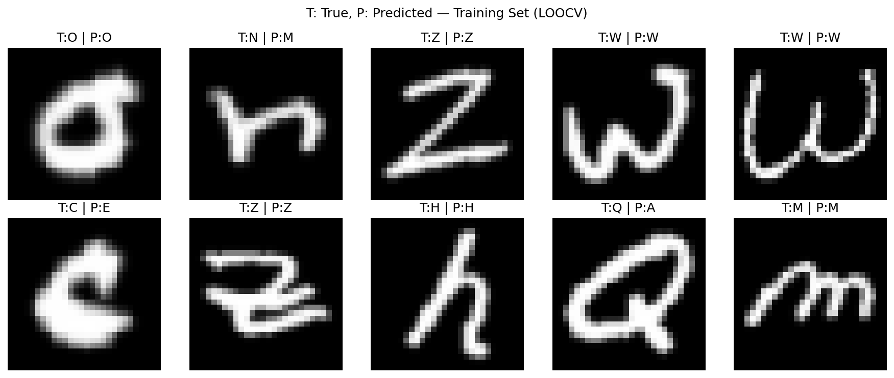
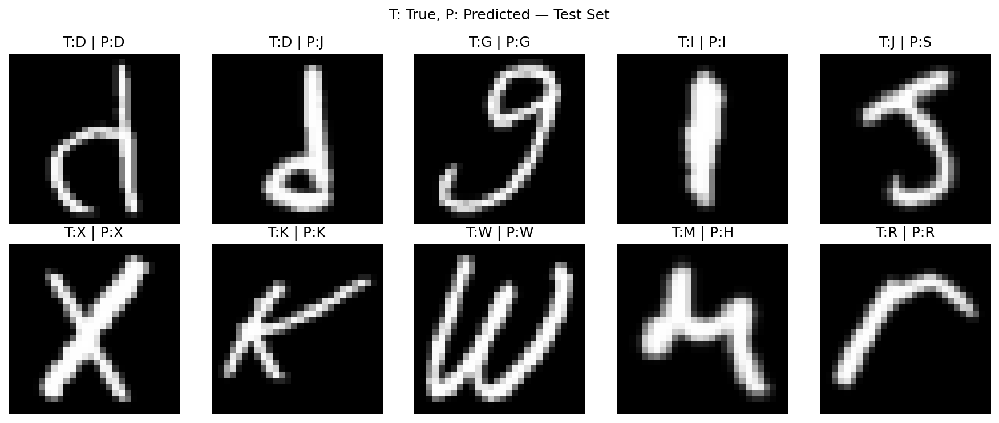

# Emnist-Classification

This Repository consists a machine learning pipeline that uses HOG (Histogram of Oriented Gradients) for feature extraction and SVM (Support Vector Machine) For Classification

## Dataset

Dataset for this project are from :

-> https://www.kaggle.com/datasets/crawford/emnist/data

Specifically the **'emnist-letters'** subset, containing a grayscael images of handwritten Alphabet Letters (A-Z).

For this Repository, **2600** samples are used with **100** per sample across all **26** sample. the dataset are split **80%** for training and **20%** for testing

## Confusion Matrix

This is the confusion matrix showing the performance of this demonstration :

## Classification Demo

This are some Example demo for the demonstration :

